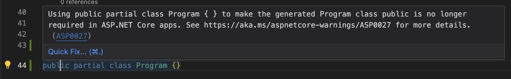

# What's new in APIs in .NET 10 Preview 1

https://github.com/dotnet/AspNetCore.Docs/issues/34622

## OpenAPI 3.1 support

https://github.com/dotnet/aspnetcore/pull/59480
https://github.com/dotnet/aspnetcore/pull/60002

ASP.NET Core has added support for generating [OpenAPI version 3.1] documents in .NET 10.
Despite the minor version bump, OpenAPI 3.1 is a significant update to the OpenAPI specification,
in particular with full support for [JSON Schema draft 2020-12].

[OpenAPI version 3.1]: https://spec.openapis.org/oas/v3.1.1.html
[JSON Schema draft 2020-12]: https://json-schema.org/specification-links#2020-12

Some of the changes you will see in the generated OpenAPI document include:
- Nullable types will no longer have the `nullable: true` property in the schema, and instead will have a `type` keyword whose value is an array that includes `null` as one of the types.

With this feature, the default OpenAPI version for generated documents will be 3.1, but you can easily change this
by explicitly setting the `OpenApiVersion` property of the `OpenApiOptions` in the `configureOptions` delegate
parameter of `AddOpenApi`.

```csharp
builder.Services.AddOpenApi(options =>
{
    // Specify the OpenAPI version to use.
    options.OpenApiVersion = Microsoft.OpenApi.OpenApiSpecVersion.OpenApi3_0;
});
```

If you are generating the OpenAPI document at build time, you can select the OpenAPI version by setting the `--openapi-version` in the `OpenApiGenerateDocumentsOptions` MSBuild item.

```xml
    <!-- Configure build-time OpenAPI generation to produce an OpenAPI 3.0 document. -->
    <OpenApiGenerateDocumentsOptions>--openapi-version OpenApi3_0</OpenApiGenerateDocumentsOptions>
```

### Breaking changes

Support for OpenAPI 3.1 requires an update to the underlying OpenAPI.NET library to a new major version, 2.0.
This new version has some breaking changes from the previous version, and this may impact your applications
if you have any document, operation, or schema transformers.
Perhaps the most significant change is that the `OpenApiAny` class has been dropped in favor of using `JsonNode` directly.
If your transformers use `OpenApiAny`, you will need to update them to use `JsonNode` instead.
For example, a schema transformer to add an example in .NET 9 might look like this:

```csharp
    options.AddSchemaTransformer((schema, context, cancellationToken) =>
    {
        if (context.JsonTypeInfo.Type == typeof(WeatherForecast))
        {
            schema.Example = new OpenApiObject
            {
                ["date"] = new OpenApiString(DateTime.Now.AddDays(1).ToString("yyyy-MM-dd")),
                ["temperatureC"] = new OpenApiInteger(0),
                ["temperatureF"] = new OpenApiInteger(32),
                ["summary"] = new OpenApiString("Bracing"),
            };
        }
        return Task.CompletedTask;
    });
```

In .NET 10 the transformer to do the same task will look like this:

```csharp
    options.AddSchemaTransformer((schema, context, cancellationToken) =>
    {
        if (context.JsonTypeInfo.Type == typeof(WeatherForecast))
        {
            schema.Example = new JsonObject
            {
                ["date"] = DateTime.Now.AddDays(1).ToString("yyyy-MM-dd"),
                ["temperatureC"] = 0,
                ["temperatureF"] = 32,
                ["summary"] = "Bracing",
            };
        }
        return Task.CompletedTask;
    });
```

Note that these changes will be necessary even if you congfigure the OpenAPI version to 3.0.

<!-- We've eliminated the schema store and you can now create new schemas directly in the document. -->

## OpenAPI in Yaml

https://github.com/dotnet/aspnetcore/pull/58616

ASP.NET now supports serving the generated OpenAPI document in YAML format.
YAML can be more concise than JSON, eliminating curly braces and quotation marks when these can be inferred.
YAML also supports multi-line strings, which can be useful for long descriptions.

To configure your application to serve the generated OpenAPI document in YAML format,
specify the endpoint in the MapOpenApi call with a ".yaml" suffix, as shown in this example:

```csharp
app.MapOpenApi("/openapi/{documentName}.yaml");
```

Support for YAML is currently only available for the the OpenAPI served from the OpenAPI endpoint.
Support for generating OpenAPI documents in YAML format at build time will be added in a future preview.

## Response description on ProducesResponseType

https://github.com/dotnet/aspnetcore/pull/58193

The ProducesAttribute, ProducesResponseTypeAttribute, and ProducesDefaultResponseType attributes now accept an optional string parameter, `Description`, that will set the description of the response. Here's an example:

```csharp
[HttpGet(Name = "GetWeatherForecast")]
[ProducesResponseType<IEnumerable<WeatherForecast>>(StatusCodes.Status200OK, Description = "The weather forecast for the next 5 days.")]
public IEnumerable<WeatherForecast> Get()
{
```

And the generated OpenAPI will be

```json
        "responses": {
          "200": {
            "description": "The weather forecast for the next 5 days.",
            "content": {
```

Community contribution!

## Better support for testing apps with top-level statements

https://github.com/dotnet/aspnetcore/pull/58199
https://github.com/dotnet/aspnetcore/pull/58482

.NET 10 now has better support for testing apps that use top-level statements.
Previously developers had to manually add `public partial class Program` to the
Program.cs file so that the test project could reference the Program class.
This is because the top-level statement feature in C# 9 generated a Program class
that was declared as internal.

In .NET 10, a source generator is used to generate the `public partial class Program`
declaration if the programmer did not declare it explicitly. In addition, an analyzer
was added to detect when `public partial class Program` is declared explicitly and
advise the developer to remove it.


